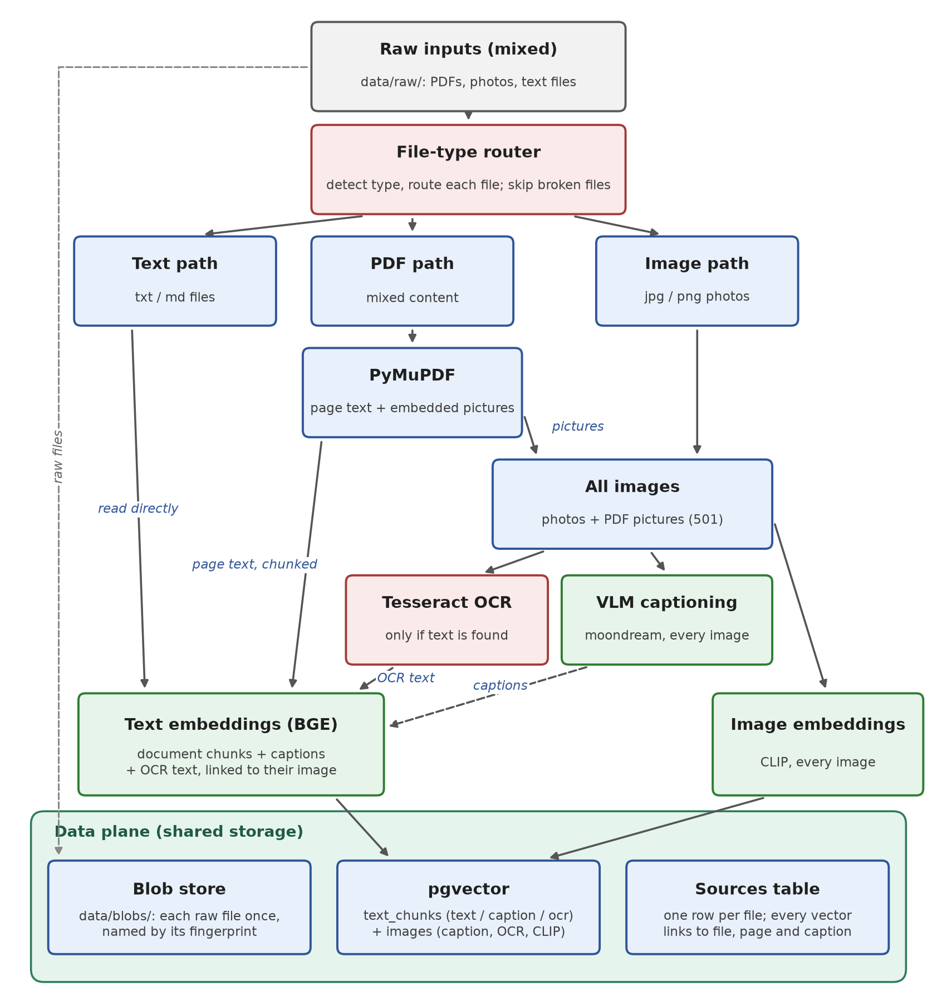
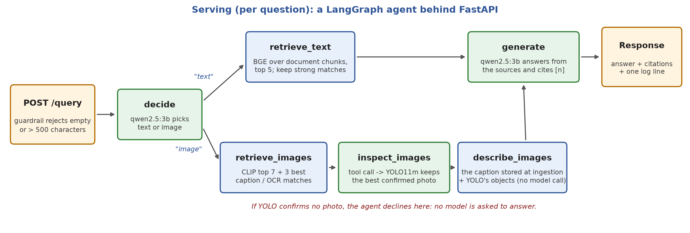

# Vision RAG Agent

Ask questions in plain English over a mix of **documents and photos**, and get short answers that **cite their sources**: a PDF page or a specific photo.

An agent decides for each question how to answer it:

- **Text questions** ("Who flew the first airplane?") search the PDF text and answer from the best passages.
- **Image questions** ("Which photo shows a dog holding a frisbee?") search the photos, use an **object detector (YOLO) as a tool** to keep only photos that really contain the right objects, then have a **vision-language model** describe the best one.
- **Questions the data can't answer** get "I couldn't find this in the documents" instead of a made-up answer.

Everything runs **locally on a 4 GB laptop GPU**: no API keys, no data leaves the machine. It is served as a **FastAPI** service with request logging and a guardrail, and measured with **RAGAS** plus exact checks on a hand-built eval set.

## Live demo

**[Try the interface](https://kvarun-teja.github.io/vision-rag-agent/demo/)**: drop in your own PDF, ask questions, and see the sentence each answer came from, highlighted on the page.

The demo is a static web page, so the AI models don't run there. Answers about the sample document (Wikipedia's "Giraffe") come from this project's agent. Questions about your own file use a simple search in your browser that quotes the closest sentence, and your file never leaves your browser.

Running the project locally serves the same kind of page at `http://localhost:8000`, connected to the full agent: upload your own PDF and the answers come from the real pipeline (see [How to run it](#how-to-run-it)).

## Example

```
$ curl -s -X POST localhost:8000/query -H "Content-Type: application/json" \
       -d '{"question": "Where and when was the steam locomotive invented?"}'
{"answer": "The steam locomotive was invented in the United Kingdom in 1802 [1].",
 "citations": [{"n": 1, "source": "Train.pdf", "page": 3}],
 "path": "text", "tokens": 1404, "latency_ms": 1589, ...}

$ curl -s -X POST localhost:8000/query -H "Content-Type: application/json" \
       -d '{"question": "Which photo shows a cat wearing a hat, and what colour is the hat?"}'
{"answer": "This photo shows a black and white cat wearing a pink knit hat ... [1]",
 "citations": [{"n": 1, "image_id": "000000286708.jpg"}],
 "path": "image", ...}
```

## Architecture

### Ingestion (offline, run once)



Every file goes through a type router. PDF text is chunked; photos and PDF pictures form one image stream that gets OCR (only where there is text) and a moondream caption. Document chunks, captions and OCR text are embedded as text (BGE), every image is embedded with CLIP, and everything lands in the data plane, where each vector links back to its source file, page and caption.

### Serving (per question)



The agent picks the text or image path. Image questions use CLIP plus caption search, the YOLO tool keeps the best photo that really contains the right objects, and the answer is written from that photo's stored caption, so no vision-language model runs at question time. Every request writes one line to `logs/requests.jsonl`.

**Models** (all through [Ollama](https://ollama.com) or sentence-transformers, all local):

| Job | Model | Why |
|---|---|---|
| Text embeddings (chunks, captions, OCR text) | `BAAI/bge-small-en-v1.5` | Small and fast; strong retrieval quality |
| Image + image-search embeddings | `clip-ViT-B-32` | Puts photos and text in the same vector space |
| Vision tool | YOLO11m (COCO, 80 objects) | ~24 ms per image; the nano version missed small objects |
| Captioning every image (at ingestion) | `moondream` (1.8B) | Fits on a 4 GB GPU; LLaVA 7B needs 5–6 GB |
| Deciding, tool calls, answers | `qwen2.5:3b` | Follows instructions and supports tool calling; moondream can't answer text-only questions |

## Results

Measured on [eval/eval_set.json](eval/eval_set.json): 30 hand-checked questions (15 text, 13 image, 2 not answerable from the data). Full per-question output: [eval/results.json](eval/results.json).

**Exact checks** (no model involved, so these are the numbers to trust):

| | Text (15) | Image (13) | Not answerable (2) |
|---|---|---|---|
| Agent picked the right path | 15/15 | 13/13 | 2/2 |
| Cited a correct source / declined | **15/15** | **9/13** | **2/2** |
| Average time per question | 1.1 s | 1.3 s | 0.1 s |

**RAGAS** (graded locally by `qwen2.5:3b`):

| | Text | Image |
|---|---|---|
| Faithfulness (claims backed by the context) | 0.72 | 0.43 |
| Answer relevancy (answers the question asked) | 0.94 | 0.54 |
| Context precision (retrieved context is useful) | 0.75 | 0.46 |
| Context recall (context holds the needed facts) | 0.93 | 0.31 |

**History.** The first full evaluation scored 14/15 text and 9/13 image, at 5.0 s per image question. Fixing the image-answer prompt, adding a relative score margin for text chunks and cleaning tool inputs in code took text to 15/15 and image questions to 2.2 s. Captioning every image at ingestion then cut image questions to 1.3 s, because answers reuse the stored caption instead of calling the vision-language model per question; accuracy stayed at 9/13.

**How much to trust RAGAS here:** re-grading the *same unchanged* text answers moved the scores by up to ±0.06, and a small change to the source labels in the prompt moved text relevancy from 0.78 to 0.94 with the same facts, so treat RAGAS differences as rough. Image context recall is low partly because the "context" is moondream's description, while the reference answer is a COCO caption written in different words. Three of the four image misses are retrieval misses: the right photo never reached the top 10.

## Design choices

- **Every image is captioned once, at ingestion.** moondream describes all 501 images (≈5 minutes on the GPU). Captions and OCR text are stored as text chunks of their own (`kind` = caption / ocr) that link back to their image, so they are searchable, and the agent reuses the stored caption instead of calling the model per question.
- **Image search: CLIP first, captions second.** The first 70% of image results are CLIP's best; the rest are caption/OCR matches CLIP missed. Merging the two rankings equally was measured and did worse (8/13 vs 11/13 in the top 3), because CLIP ranked the right photo first or second for 11 of 13 questions while moondream's captions often mislabel details.
- **Blob store and metadata table.** Each raw file is kept once in `data/blobs/`, named by its SHA-256 fingerprint; the `sources` table has one row per input file (type, blob path, fingerprint, pages), and every vector row links back to its source, page and (for images) caption.
- **pgvector behind a retriever interface.** [retrieval/retriever.py](retrieval/retriever.py) defines `search_text()` / `search_images()`; the agent and API only call those. Postgres keeps vectors and their labels (file, page, OCR text) in one place; switching to Qdrant or OpenSearch means writing one new class.
- **YOLO before the vision-language model.** Image search (CLIP) is fuzzy; YOLO is precise and cheap. Screening 10 candidates with YOLO costs ~0.25 s, while describing one photo with moondream costs ~0.5–1 s and ~740 of its 2,048 tokens. Describing only the top YOLO-confirmed photo was both cheaper and more accurate on the eval set than describing the top search result or letting the language model pick between three.
- **The agent calls the tool through real tool calling.** qwen is shown a tool description and replies with `find_objects(objects=["dog", "frisbee"])`; our code validates those inputs against YOLO's labels and runs the detector.
- **Two layers of grounding.** If no chunk scores above a measured cutoff, the model is never called and the system declines. Otherwise the prompt allows only the numbered sources and requires `[n]` citations, which are mapped back to files and pages (numbers that don't exist are ignored).
- **Thresholds come from measurements, not guesses.** The first cutoff, 0.70, was measured on the Wikipedia questions alone (answerable ≥ 0.74, unanswerable ≤ 0.65). An uploaded resume then showed that it doesn't carry over: a resume packs many short facts into each chunk, so correct answers scored only 0.58–0.74 and most resume questions were declined. The cutoff is now 0.55, just above clearly off-topic questions (≤ 0.53). Near-misses (0.57–0.64) now reach the model, which declined all 7 that were tested, and the eval results didn't change. Top-k came from [retrieval/tune_top_k.py](retrieval/tune_top_k.py).

## Limitations

- **The RAGAS grader is the same 3B model.** It sometimes gives 0 faithfulness to answers copied word for word from the source, so the exact checks (right path, right source cited, declined when it should) are the more reliable numbers.
- **CLIP confuses similar photos** (a moped vs. a row of motorcycles), and **YOLO can't see colours**, so colour-specific image questions can pick the wrong photo.
- **Small models are literal.** The image-answer prompt was tuned on the eval set; with only 13 image questions, treat image scores as indicative.
- **Routing by wording.** A document question that mentions photos or pictures ("How big was the dataset of underwater pictures?") can be sent down the image path and get a wrong answer.
- **Citation numbers.** Given a single source, the model sometimes writes [2]; numbers that don't exist are dropped, so that answer shows no source.
- **Single-user.** One shared database connection and models loaded in one process; fine for a demo, not for heavy traffic.

## How to run it

**You need:** Linux with an NVIDIA GPU (4 GB is enough), [conda](https://docs.conda.io), [Docker](https://docs.docker.com/engine/install/), [Ollama](https://ollama.com), and Tesseract (`sudo apt install tesseract-ocr`).

```bash
# 1. Python environment (pick the PyTorch CUDA build your driver supports: see nvidia-smi and pytorch.org)
conda create -n RAG python=3.11 -y && conda activate RAG
pip install torch torchvision --index-url https://download.pytorch.org/whl/cu130
pip install -r requirements.txt

# 2. Local models
ollama pull moondream
ollama pull qwen2.5:3b

# 3. Database (reachable only from this computer)
docker run -d --name rag-postgres -e POSTGRES_PASSWORD=localdev -p 127.0.0.1:5432:5432 pgvector/pgvector:pg16

# 4. Settings, data, ingestion
cp .env.example .env
python scripts/download_data.py      # 10 Wikipedia PDFs + 200 COCO photos (~300 MB)
python -m ingestion.run              # ~6 min on a GPU (mostly captioning 501 images); re-runs take ~1 s
# add --fresh to drop the tables and rebuild everything from data/raw

# 5. Serve
uvicorn api.main:app --port 8000     # then open http://localhost:8000 (upload page) or /docs (API)
```

**Or with Docker Compose** (API on the CPU, Ollama still on the host GPU; after steps 2 and 4's download):

```bash
docker compose up -d db
docker compose run --rm api python -m ingestion.run   # first time only
docker compose up -d api
```

**Tests and evaluation:**

```bash
python -m pytest tests/              # ingestion checks
python -m retrieval.tune_top_k       # how often the right source is in the top k
python -m eval.run_eval              # agent + RAGAS on the 30 eval questions (~10 min)
```

## Project layout

```
ingestion/   router, PDF parsing, images, OCR, captions (caption.py), chunking, embedding, blob store, storing, run.py
retrieval/   the retriever interface + pgvector implementation, top-k tuning
agent/       llm.py (Ollama calls), generate.py (grounded answers), vision_tool.py (YOLO), graph.py (LangGraph agent)
api/         FastAPI app: /query, /upload, /images, /health, guardrail, request log, and the upload page (static/index.html)
eval/        eval_set.json, run_eval.py, results.json
scripts/     dataset download and three small concept demos (calling a model, text and image embeddings)
tests/       pytest checks for ingestion, the blob store and caption/OCR chunks
config.py    all settings, read from .env
```

## Data and licences

Text: Wikipedia articles (CC BY-SA 4.0), downloaded as PDFs through the Wikimedia REST API. Photos and captions: [COCO 2017 validation set](https://cocodataset.org) (annotations CC BY 4.0; images under their Flickr licences). The data is downloaded by the script and not stored in this repository.
